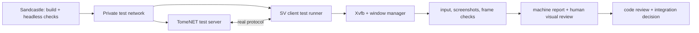

# Sandcastle for TomeNET SV

Sandcastle creates a Docker container and a Git worktree for each development
run. The orchestrator in `.sandcastle/workflow.mjs` keeps the state of each task
in ignored `.sandcastle/runs/<run-id>/state.json` and commits all final task
artifacts to `modern_interface` after verification.

## Setup

Install Node.js, npm, Docker and a host Codex CLI. Build the container image:

```sh
npm ci
npm run sandbox:image
npm run sandbox:login
```

`npm run sandbox:login` signs in the host CLI with a separate Codex home at
`.sandcastle/auth/`. Device-code login works with a ChatGPT subscription; an
API key is optional. The auth directory is ignored by Git and must remain
private. `npm run sandbox:login -- status` confirms that the container can read
credentials; the development workflow also probes the account quota before
creating a sandbox. It stops if that probe cannot read the weekly window.

The development container uses host networking to reach the host's local proxy.
Build, test, and registry containers use Docker bridge networking. The SV core
checks are headless and do not replace display-backed acceptance.

## Development workflow

From a clean checkout on `modern_interface`, supply a repository task/spec file:

```sh
SANDCASTLE_SPEC='docs/tasks/<ticket>.md' npm run sandbox:dev
```

An assistant can also supply the exact request text as `SANDCASTLE_TASK`.
The command prints a run ID. Fresh ephemeral Codex CLI processes implement
ready tickets concurrently, with a separate container, Git branch and worktree
for each worker:

1. A read-only agent derives a numbered acceptance contract from the original
   task and AGENTS.md. A separate fresh agent checks completeness against the
   sources. At most two proposals are allowed; implementation starts only after
   approval. The controller commits the fixed contract and check set under
   `.scratch/sandcastle-<run-id>/acceptance-contract.json`.
2. The `to-tickets` skill splits the request into small vertical tickets in
   `.scratch/sandcastle-<run-id>/issues/`. The user's standing instruction to
   proceed autonomously replaces its interactive approval quiz.
3. The scheduler selects tickets whose dependencies have been completed and
   integrated. Up to `SANDCASTLE_PARALLELISM` workers (default 3, range 1–8)
   start from the same committed integration revision. Workers never share
   editable files and commit their own results.
4. An assembly agent merges successful worker revisions with Git, resolves
   conflicts using `resolving-merge-conflicts`, and checks the combined result.
   The orchestrator verifies commit ancestry, resolved tickets and a clean
   worktree before marking any new dependencies ready. Failed and blocked
   branches are retained; successful siblings are not rerun on continuation.
5. The Make build runs. A build failure becomes a batch of repair tickets,
   followed by parallel workers, assembly and another build attempt, up to
   10 attempts. Repair batches do not reset the attempt counters.
6. A testing ticket checks the production SV path and may add focused tests
   in its own worker branch, then passes through the same assembly stage.
   The orchestrator runs `.sandcastle/checks.sh core` and the contract's required
   feature checks at the same committed HEAD; a failure starts a repair
   ticket batch, workers and assembly, followed by another build and test
   attempt, up to 10 failed tests.
7. The `code-review` skill reviews Standards and Spec, using parallel review
   sub-agents inside the review stage. It returns evidenced criterion statuses,
   deduplicated findings, resolutions, residual decisions and behavior to keep.
   Open findings become mapped repair tickets through the same pipeline, up to
   5 review rounds and three integrated repair cycles per defect.
8. A fresh read-only final auditor inspects the original task, fixed contract,
   baseline/final code and controller check evidence. It receives candidate
   residual risks, without previous reviews or ticket Answers, and must confirm
   each residual independently. A failed final audit permits one repair cycle
   and one repeat audit; remaining blockers stop the run.
9. A tracked report is written under `docs/tasks/sandcastle/`. The sandbox
  branch is fast-forwarded into `modern_interface` after the gates pass.

## Acceptance contract and closure gate

The contract records each criterion's stable ID, verifiable requirement,
literal source quote, mandatory flag, current/deferred applicability, checks
and owning task for deferred obligations. The independent verifier must reject
omitted requirements, unsupported deferrals and behavior mislabeled optional.
All originating requirements remain mandatory. Implementation readiness may
leave later full acceptance pending only where the original task permits it;
the report states its completion scope explicitly.

The fixed automated set always includes the exact SV Make build and core
checks, plus production feature checks needed by current mandatory criteria.
Focused command checks can invoke `python3 -B tests/<file> [args]`,
`node tests/<file> [args]` or `bash tests/<file> [args]`, without shell operators.
An applicable required check without a runner/environment blocks closure; an
agent cannot substitute its statement for a controller-executed check. The
controller records check ID, result, log, contract digest and exact code HEAD.
Checks and reviewers must leave the committed worktree unchanged. Changing the
accepted contract in a worker branch stops the process for a scope decision.

Closure is deterministic: every current mandatory criterion passes, every
required check passes at the final audited HEAD, all worker commits are
integrated, and no open blocker remains. The controller emits one verdict:

- `ready`: the scoped result passes and has no accepted residual defects.
- `ready_with_notes`: it passes with explicitly accepted optional low cosmetic
  or maintainability issues, each with reason, risk, owner and return condition.
- `blocked`: at least one required criterion/check, defect or final audit is
  unresolved. A score such as 8/10 cannot override this verdict.

Critical, high and medium findings block closure. Behavioral regressions,
security, data loss, protocol changes, scope violations, false evidence and
unmet mandatory criteria block closure even if labeled low. Residual decisions
can reference only optional current criteria. They are published as **open**
backlog files under `.scratch/sandcastle-<run-id>/residuals/`, alongside the final
report's coverage, pending checks, preserved behavior and incident history.
Deferred native/platform checks are reported as not run, rather than passed.

Findings have stable `defectKey` and production `area`; controller IDs do not
depend on a filename, line number or changing title. The review consolidator
reuses known IDs for paraphrases/moved code and deduplicates Standards/Spec
findings before planning. The controller folds identical keys, retains the
strongest impact, rejects identity changes under an existing ID, and persists
the ledger across restarts. Semantic matching of differently phrased findings
is the review agent's responsibility; it is not inferred from line proximity.
A missing finding in the next review stays open until an explicit resolution
with current evidence. Resolved/accepted findings reopen on new evidence.

Repair manifests name `findingIds`. A defect's counter advances once when all
its mapped repair tickets have been verified and integrated, even across
several waves. Failed workers, reviews of unchanged code and assembly retries
do not consume another repair cycle. After three unsuccessful integrated
repairs, a remaining blocker stays open and requires a human decision. Recovery
cannot defer a review repair, waive the gate, or reset the per-defect/final-audit
ceiling. Broader `SANDCASTLE_CONTINUE` allowances still apply only to the
existing build/test/review/quota budgets.

Contract proposals, assessments, ledger, mapped repair counters and check logs
are checkpointed on disk before publication. Interrupted publication reuses
the saved response. Schema files are mounted read-only from the host runtime,
so resuming an older task branch uses the current controller schema.

On an explicitly authorized resume, a legacy run first creates and verifies a
contract, preserving its saved wave, worker commits, quota and cycle counters.
This cannot retroactively establish a pre-implementation contract for existing
commits; the report records that limitation. Old reviews remain available to
reconcile identity, but per-defect counters start with mapped repair batches
after migration. A legacy report/integration checkpoint reruns build/testing,
review and the fresh final audit before closure. Updating the process does not
resume stopped runs or change heartbeat settings.

## Recovery and budgets

Recoverable stage failures invoke a dedicated AI recovery orchestrator. It runs
as an ephemeral, read-only host Codex CLI process, so diagnosis does not depend
on a working development container. The agent reads the saved incident,
original scope, ticket dependencies and Git evidence, then returns one action:

- `retry`: repeat the saved checkpoint, preserving completed workers.
- `repair`: send concrete guidance to the existing worker/assembly agent, or
  plan focused build/test/manifest repairs through the normal ticket pipeline.
- `defer`: leave a blocked implementation ticket open until an identified,
  existing external owner supplies its missing prerequisite; its downstream
  dependents are also deferred while independent tickets continue.
- `stop`: preserve the checkpoint and explain the action needed from the user.

The controller validates and applies the decision. It never defers a completed
ticket, discards an unmerged successful worker, or skips a required test gate.
Deferral records the dependency and reason in the ticket, map, original owner,
manifest and final report. Worker branches remain available as evidence. The
accepted decision is saved before publishing metadata, so an interrupted
publication replays idempotently without another AI decision.

Three automatic decisions without progress at the same checkpoint stop the
run. A failed recovery agent or invalid decision also preserves the run for
inspection. Recovery cannot reset quota or build/test/review limits. It reads
the account's weekly Codex usage before and after each agent and stops when this
task has consumed 25 percentage points of the weekly window. Quota reads and
state writes are serialized even when workers run concurrently. If
`SANDCASTLE_TASK_TOKEN_LIMIT` is set to a positive integer, it also stops after
that many reported Codex input and output tokens. These are checkpoints between
agent processes; an already-running wave may cross a threshold before its next
checkpoint. No API key or auth token is copied into task reports.

For a stopped task, inspect `.sandcastle/runs/<run-id>/state.json` and the
tracked branch. To ask the recovery agent to diagnose an existing stop while
retaining all current budgets and attempt limits:

```sh
SANDCASTLE_RECOVER=1 npm run sandbox:resume -- <run-id>
```

Quota and exhausted cycle guards still require explicit continuation. After
approving only additional quota (for example, 10 percentage points), run:

```sh
SANDCASTLE_EXTRA_QUOTA_PERCENT=10 npm run sandbox:resume -- <run-id>
```

This preserves consumed quota, token accounting and all cycle limits, records
the grant, and raises the saved quota cap by the authorized allowance from the
current consumption or previous cap, whichever is greater. It resumes only a
task quota pause; account usage limits still apply. Recovery uses the saved cap
and cannot raise it. Do not combine this with CONTINUE or RECOVER.

For the broader continuation allowance, run:

```sh
SANDCASTLE_CONTINUE=1 npm run sandbox:resume -- <run-id>
```

This grants another 10 build attempts, 10 test attempts, 5 review rounds and a
new 25% weekly quota allowance for that task. A process interruption before a
limit can be resumed with `npm run sandbox:resume -- <run-id>`; the orchestrator
commits interrupted worktree changes before reopening the sandbox branch.
An unresolved merge stays in its managed worktree for the assembly agent;
conflict markers are never automatically committed. Saved waves retain worker
revisions and outcomes, so continuation retries only unfinished workers or
assembly rather than starting the task again.
Do not run the same task twice concurrently. If the current checkout has
uncommitted changes or another commit advances `modern_interface`, integration
stops for inspection rather than overwriting those changes.

Ticket dependencies may refer to earlier tickets in the same batch or completed
tickets from earlier batches. Unresolved and deferred tickets cannot satisfy a
dependency. Implementation agents return a structured `completed` or `blocked`
result; `completed` also requires a resolved Markdown ticket with an Answer.
A blocked result preserves the frontier and stops the workflow for inspection.
An agent exiting successfully by itself is not evidence of ticket completion.

Planning saves a `plan-validate` checkpoint before accepting its manifest, so a
validation failure can be repaired and resumed without repeating decomposition.
The originating specification controls implementation scope. Explicit later
caller integrations and platform acceptance remain pending at their original
owners; generated tickets and review findings cannot silently pull them into
the current implementation or count them as passed.

`SANDCASTLE_MODEL` selects the model (default `gpt-6-sol`), and
`SANDCASTLE_REASONING_EFFORT` selects its effort (default `high`). The
`to-tickets`, `code-review`, `tdd` and `resolving-merge-conflicts` skills are
mounted read-only from `~/.agents/skills/`; set `SANDCASTLE_SKILLS_ROOT` when
installed elsewhere.

## Other commands

```sh
npm run sandbox:build
npm run sandbox:test
npm run sandbox:registry
```

`build` copies the Linux executable to `.sandcastle/artifacts/tomenet-sv`.
`test` runs the core headless SV checks; `registry` runs provenance checks
separately. Existing registry source digest failures remain documented in
[the issue log](sandcastle-issues.md).

## Stage status and delivery

Each finished ticket, scheduler/assembly stage, build, test, review, recovery decision and
workflow pause produces a durable event in
`.sandcastle/runs/<run-id>/events.jsonl`. Events have a monotonically increasing
`seq`, survive restarts, and contain synthesized summaries and progress rather
than prompts, specification content, credentials or raw command errors.
The replaceable `events.latest.json` snapshot is convenient for a dashboard.

Read current state and all stage events, or only those after a known cursor:

```sh
npm run sandbox:status -- <run-id>
npm run sandbox:status -- <run-id> --after 12
```

For immediate event-driven delivery, set `SANDCASTLE_STATUS_HOOK` to an absolute
executable path. It receives one argument: an immutable JSON file for the
event. The hook must deliver through a configured, supported messaging bridge;
the journal itself does not post messages into Codex chats. Hook execution has
a bounded timeout (5 seconds by default, at most 30 seconds via
`SANDCASTLE_STATUS_HOOK_TIMEOUT_MS`) and receives only PATH in its environment.
Delivery success/failure is recorded in `deliveries.jsonl`; a delivery failure
does not interrupt code work. A bridge can replay unacknowledged events by seq.

For status in the current Codex chat, a thread heartbeat can poll this journal
on a minute-based schedule. It should report every new stage outcome in order,
keep its own per-run cursor, and stay silent when no event changed. This gives
per-stage reports with polling latency, rather than an immediate push from
Docker. Configure the heartbeat using the app automation tool; do not write to
Codex internal chat databases or inject messages through an unrelated CLI
app-server process. Existing running orchestrators acquire this event journal
and parallel scheduler when restarted with the updated workflow. The recovery
orchestrator likewise becomes active on restart. Recovery decisions are saved
in `state.json` and `recovery-<number>.json`; the final report includes their
tracked records under `.scratch/sandcastle-<run-id>/recovery/`.

## Planned local-server and visual acceptance

The current `sandbox:test` gate remains the fast, headless check. Two additional
gates are required for future SV work: a real client/server round trip against a
private test server, and a display-backed check of the native UI. Neither gate
is implemented by the current Sandcastle commands. A successful dummy-video
smoke run must not be reported as either gate passing. The current synthetic
shell does not yet provide a complete gameplay session; add the applicable
client/server scenarios as production SV flows become available.



### Local test server contract

- Build `src/tomenet.server` from the same committed revision as the SV client,
  using `make -C src -f makefile tomenet.server` in a separate server image. Do
  not change the legacy server build or shared code merely to support the test
  harness.
- Create a new Docker `internal` network for each run. Attach only the server
  and client test-runner containers to it; publish no ports and never use host
  networking. Keep the Codex development container outside this network so it
  can reach the Codex API. The client runner must have no route to the official
  server or metaserver.
- Start the server with `TOMENET_PATH` pointing to an isolated, writable test
  library tree. Copy required tracked `lib/` assets into it, then apply
  versioned scenario fixtures for server configuration and test content. Do not
  mount the checkout's `lib/save`, `lib/data`, or personal client profile for
  writing. Give every scenario a fresh data/save directory.
- Set `REPORT_TO_METASERVER = false` and `WORLDSERVER = ""` in the test
  configuration. Use an internal DNS name such as `tomenet-test` and explicit
  `--endpoint --server tomenet-test --port <test-port>` on the SV client. Keep
  game, console, and gateway ports inside the private network. Fixtures may
  configure gameplay content through actual server data and supported server
  mechanisms; tests must still exercise the production SV path.
- Wait for a bounded server-ready signal before launching the client. Fail on
  startup errors, timeouts, failed protocol checks, or unexpected disconnects.
  Record the server/client revisions, configuration, logs, and scenario results;
  stop the containers and delete the private network after each run. The test
  runner must not treat a listening TCP port alone as proof of a usable server.

### Display-backed UI contract

- Run the compiled SV client in a separate UI test runner with Xvfb and a
  window manager, `SDL_VIDEODRIVER=x11`, and an explicit renderer. This is a
  distinct stage from the existing `SDL_VIDEODRIVER=dummy` smoke suite. The
  UI runner is the client test runner for combined server-plus-display
  scenarios; attach it only to the private network in those runs.
- Exercise the real SDL window with injected keyboard/mouse input and capture
  screenshots plus window geometry and renderer/scale metadata. Check that the
  expected surfaces and state transitions are present, that one system window
  is used, and that rendered pixels are nonempty. Include startup, focus,
  resize, failure, and relevant in-game scenarios as those production flows
  arrive. Preserve images and logs for failed cases.
- Do not use the legacy client as a pixel oracle or require exact golden-frame
  equality: the [canonical raster pipeline](../CONTEXT.md) requires semantic
  identity, geometry, color roles, layer order, visibility, and lifecycle.
  Screenshots and automated checks support, but do not replace, human review
  of readability, perceived response, and real desktop behavior at applicable
  OS scales. Record that review separately from machine results.

These gates should become required for tickets that change live protocol flows
or visible surfaces, respectively. A ticket that changes both requires a
combined server-plus-display scenario. Only after their runners, fixtures, and
failure reports are implemented should `sandbox:dev` invoke them before the
final `$code-review` stage. Until then, report them as **not run**, never as
passed by the existing headless checks.
