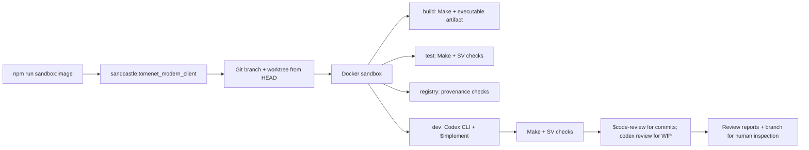
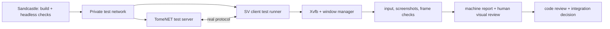

# Sandcastle for TomeNET SV

[Sandcastle](https://github.com/mattpocock/sandcastle) creates a Docker sandbox
and Git worktree for each run. The sandbox invokes the existing SV Makefile and
production-path checks. The repository's native build remains Make-based.



The local `sandcastle:tomenet_modern_client` image is built from
`node:22-trixie-slim`. No Fedora builder image is used by these commands.

## Setup

Requires Node.js, npm, Git, and a working Docker daemon. From the repository
root:

```sh
npm ci
npm run sandbox:image
```

For interactive development and code review, create `.sandcastle/.env` from
`.sandcastle/.env.example` and set `OPENAI_API_KEY` for the Codex CLI. Sandcastle
passes it into the container and signs in Codex for the development session.
The file is ignored by Git. Build and test commands do not require an agent
credential. This follows the [official Codex CLI API-key login procedure](https://learn.chatgpt.com/docs/auth).

## Commands

```sh
npm run sandbox:build
npm run sandbox:test
npm run sandbox:registry
npm run sandbox:dev
```

`sandbox:build` compiles `src/tomenet-sv` in the container and copies it to
`.sandcastle/artifacts/tomenet-sv`. This Linux executable uses the container's
shared libraries; run it in a compatible environment. `sandbox:test` builds the
same target, runs the SV runtime and protocol checks through their production
entry points, then runs `sv_shell_smoke.py` using SDL's dummy video and software
renderer. `sandbox:registry` runs the capability, evidence, and review contract
checks separately. The current committed manifest has stale source digests for
`src/makefile.sv`, so two capability checks fail until that provenance is
reviewed and refreshed. The headless suite does not replace desktop rendering
reviews in the SV evidence documents.

`sandbox:dev` requires `SANDCASTLE_SPEC`, the path to an originating task or
specification file. Sandcastle passes its contents to Codex and explicitly
invokes `$implement` through `.sandcastle/dev-prompt.md`. The `implement`,
`tdd`, and `code-review` skills are mounted read-only from
`~/.agents/skills/` into the container. Set `SANDCASTLE_SKILLS_ROOT` if they
are installed elsewhere. `$implement` uses TDD where test seams are agreed
and commits the result. Sandcastle then rebuilds, runs the runtime tests, and
handles the skill's required code review as a separate stage in the same
container.

The development agent uses
`--ask-for-approval never --sandbox danger-full-access` inside Docker, so its
commands do not pause for approval. The final `$code-review` examines committed
changes against repository standards and the supplied spec with two parallel
sub-agents. If there are also uncommitted changes, `codex review` checks those
separately because the skill's fixed-point diff covers committed changes.
Reports are written to `.sandcastle/reviews/` on the host. Set
`SANDCASTLE_CODE_REVIEW_SKILL_PATH` if that skill alone is installed elsewhere.
The skills may still request task clarification; specify test seams in the
task file when you want TDD to proceed without a design question.

For example:

```sh
SANDCASTLE_SPEC='docs/tasks/<ticket>.md' npm run sandbox:dev
```

The review also runs without an additional nested sandbox or approval prompts.
Docker is the execution boundary. The agents have the container user's access to
the mounted worktree and Git metadata, as well as the API key supplied for the
session. Findings are advisory and require human inspection before integration.
If build or tests fail, the review stage is not reached. Set
`SANDCASTLE_MODEL` to select the Codex CLI model for development and review;
the default is `gpt-5.4`.

Sandcastle creates a fresh `codex/sandcastle-*` branch from committed `HEAD`.
Uncommitted source edits in the current checkout are not included. The tool
prints the branch and worktree paths. It preserves a worktree if the session
leaves uncommitted changes; review that path before continuing. Build and test
worktrees are removed when clean.

The setup is scoped to the SV Linux target. Server, legacy, MinGW, Wine, and
display-backed acceptance commands remain documented in their existing build
and evidence instructions.

## Planned local-server and visual acceptance

The current `sandbox:test` gate remains the fast, headless check. Two additional
gates are required for future SV work: a real client/server round trip against a
private test server, and a display-backed check of the native UI. Neither gate
is implemented by the current Sandcastle commands. A successful dummy-video
smoke run must not be reported as either gate passing. The current synthetic
shell does not yet provide a complete gameplay session; add the applicable
client/server scenarios as production SV flows become available.



### Local test server contract

- Build `src/tomenet.server` from the same committed revision as the SV client,
  using `make -C src -f makefile tomenet.server` in a separate server image. Do
  not change the legacy server build or shared code merely to support the test
  harness.
- Create a new Docker `internal` network for each run. Attach only the server
  and client test-runner containers to it; publish no ports and never use host
  networking. Keep the Codex development container outside this network so it
  can reach the Codex API. The client runner must have no route to the official
  server or metaserver.
- Start the server with `TOMENET_PATH` pointing to an isolated, writable test
  library tree. Copy required tracked `lib/` assets into it, then apply
  versioned scenario fixtures for server configuration and test content. Do not
  mount the checkout's `lib/save`, `lib/data`, or personal client profile for
  writing. Give every scenario a fresh data/save directory.
- Set `REPORT_TO_METASERVER = false` and `WORLDSERVER = ""` in the test
  configuration. Use an internal DNS name such as `tomenet-test` and explicit
  `--endpoint --server tomenet-test --port <test-port>` on the SV client. Keep
  game, console, and gateway ports inside the private network. Fixtures may
  configure gameplay content through actual server data and supported server
  mechanisms; tests must still exercise the production SV path.
- Wait for a bounded server-ready signal before launching the client. Fail on
  startup errors, timeouts, failed protocol checks, or unexpected disconnects.
  Record the server/client revisions, configuration, logs, and scenario results;
  stop the containers and delete the private network after each run. The test
  runner must not treat a listening TCP port alone as proof of a usable server.

### Display-backed UI contract

- Run the compiled SV client in a separate UI test runner with Xvfb and a
  window manager, `SDL_VIDEODRIVER=x11`, and an explicit renderer. This is a
  distinct stage from the existing `SDL_VIDEODRIVER=dummy` smoke suite. The
  UI runner is the client test runner for combined server-plus-display
  scenarios; attach it only to the private network in those runs.
- Exercise the real SDL window with injected keyboard/mouse input and capture
  screenshots plus window geometry and renderer/scale metadata. Check that the
  expected surfaces and state transitions are present, that one system window
  is used, and that rendered pixels are nonempty. Include startup, focus,
  resize, failure, and relevant in-game scenarios as those production flows
  arrive. Preserve images and logs for failed cases.
- Do not use the legacy client as a pixel oracle or require exact golden-frame
  equality: the [canonical raster pipeline](../CONTEXT.md) requires semantic
  identity, geometry, color roles, layer order, visibility, and lifecycle.
  Screenshots and automated checks support, but do not replace, human review
  of readability, perceived response, and real desktop behavior at applicable
  OS scales. Record that review separately from machine results.

These gates should become required for tickets that change live protocol flows
or visible surfaces, respectively. A ticket that changes both requires a
combined server-plus-display scenario. Only after their runners, fixtures, and
failure reports are implemented should `sandbox:dev` invoke them before the
final `$code-review` stage. Until then, report them as **not run**, never as
passed by the existing headless checks.
