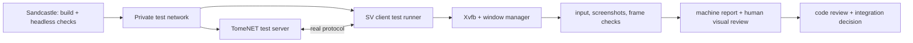

# Sandcastle for TomeNET SV

Sandcastle creates a Docker container and a Git worktree for each development
run. The orchestrator in `.sandcastle/workflow.mjs` keeps the state of each task
in ignored `.sandcastle/runs/<run-id>/state.json` and commits all final task
artifacts to `modern_interface` after verification.

## Setup

Install Node.js, npm, Docker and a host Codex CLI. Build the container image:

```sh
npm ci
npm run sandbox:image
npm run sandbox:login
```

`npm run sandbox:login` signs in the host CLI with a separate Codex home at
`.sandcastle/auth/`. Device-code login works with a ChatGPT subscription; an
API key is optional. The auth directory is ignored by Git and must remain
private. `npm run sandbox:login -- status` confirms that the container can read
credentials; the development workflow also probes the account quota before
creating a sandbox. It stops if that probe cannot read the weekly window.

The development container uses host networking to reach the host's local proxy.
Build, test, and registry containers use Docker bridge networking. The SV core
checks are headless and do not replace display-backed acceptance.

## Development workflow

From a clean checkout on `modern_interface`, supply a repository task/spec file:

```sh
SANDCASTLE_SPEC='docs/tasks/<ticket>.md' npm run sandbox:dev
```

An assistant can also supply the exact request text as `SANDCASTLE_TASK`.
The command prints a run ID. One fresh, ephemeral Codex CLI process runs at a
time for each agent stage:

1. The `to-tickets` skill splits the request into small vertical tickets in
   `.scratch/sandcastle-<run-id>/issues/`. The user's standing instruction to
   proceed autonomously replaces its interactive approval quiz.
2. Separate agents implement the tickets in dependency order. Each process
   exits before the next one starts. The orchestrator commits each ticket's
   changes to the sandbox branch.
3. The Make build runs. A build failure starts a repair agent, then another
   build attempt, up to 10 attempts.
4. A testing agent checks the production SV path and may add focused tests.
   The orchestrator runs `.sandcastle/checks.sh core`; a failure starts a repair
   agent, followed by another build and test attempt, up to 10 failed tests.
5. The `code-review` skill reviews Standards and Spec, using parallel review
   sub-agents inside the review stage. Findings become new small tickets and
   repeat steps 2–5, up to 5 review rounds.
6. A tracked report is written under `docs/tasks/sandcastle/`. The sandbox
   branch is fast-forwarded into `modern_interface` after the gates pass.

The workflow asks for human action only if a critical stage fails, a cycle limit
is reached, Codex usage becomes unavailable, or the quota guard fires. It reads
the account's weekly Codex usage before and after each agent and stops when this
task has consumed 25 percentage points of the weekly window. If
`SANDCASTLE_TASK_TOKEN_LIMIT` is set to a positive integer, it also stops after
that many reported Codex input and output tokens. These are checkpoints between
agent processes; one running process may cross a threshold before its next
checkpoint. No API key or auth token is copied into task reports.

For a stopped task, inspect `.sandcastle/runs/<run-id>/state.json` and the
tracked branch. After explicitly approving continuation, run:

```sh
SANDCASTLE_CONTINUE=1 npm run sandbox:resume -- <run-id>
```

This grants another 10 build attempts, 10 test attempts, 5 review rounds and a
new 25% weekly quota allowance for that task. A process interruption before a
limit can be resumed with `npm run sandbox:resume -- <run-id>`; the orchestrator
commits any interrupted worktree changes before reopening the sandbox branch.
Do not run the same task twice concurrently. If the current checkout has
uncommitted changes or another commit advances `modern_interface`, integration
stops for inspection rather than overwriting those changes.

Ticket dependencies may refer to earlier tickets in the same batch or completed
tickets from earlier batches. Unresolved and deferred tickets cannot satisfy a
dependency. Implementation agents return a structured `completed` or `blocked`
result; `completed` also requires a resolved Markdown ticket with an Answer.
A blocked result preserves the frontier and stops the workflow for inspection.
An agent exiting successfully by itself is not evidence of ticket completion.

Planning saves a `plan-validate` checkpoint before accepting its manifest, so a
validation failure can be repaired and resumed without repeating decomposition.
The originating specification controls implementation scope. Explicit later
caller integrations and platform acceptance remain pending at their original
owners; generated tickets and review findings cannot silently pull them into
the current implementation or count them as passed.

`SANDCASTLE_MODEL` selects the model (default `gpt-6-sol`), and
`SANDCASTLE_REASONING_EFFORT` selects its effort (default `high`). The
`to-tickets`, `code-review`, and `tdd` skills are mounted read-only from
`~/.agents/skills/`; set `SANDCASTLE_SKILLS_ROOT` when installed elsewhere.

## Other commands

```sh
npm run sandbox:build
npm run sandbox:test
npm run sandbox:registry
```

`build` copies the Linux executable to `.sandcastle/artifacts/tomenet-sv`.
`test` runs the core headless SV checks; `registry` runs provenance checks
separately. Existing registry source digest failures remain documented in
[the issue log](sandcastle-issues.md).

## Planned local-server and visual acceptance

The current `sandbox:test` gate remains the fast, headless check. Two additional
gates are required for future SV work: a real client/server round trip against a
private test server, and a display-backed check of the native UI. Neither gate
is implemented by the current Sandcastle commands. A successful dummy-video
smoke run must not be reported as either gate passing. The current synthetic
shell does not yet provide a complete gameplay session; add the applicable
client/server scenarios as production SV flows become available.



### Local test server contract

- Build `src/tomenet.server` from the same committed revision as the SV client,
  using `make -C src -f makefile tomenet.server` in a separate server image. Do
  not change the legacy server build or shared code merely to support the test
  harness.
- Create a new Docker `internal` network for each run. Attach only the server
  and client test-runner containers to it; publish no ports and never use host
  networking. Keep the Codex development container outside this network so it
  can reach the Codex API. The client runner must have no route to the official
  server or metaserver.
- Start the server with `TOMENET_PATH` pointing to an isolated, writable test
  library tree. Copy required tracked `lib/` assets into it, then apply
  versioned scenario fixtures for server configuration and test content. Do not
  mount the checkout's `lib/save`, `lib/data`, or personal client profile for
  writing. Give every scenario a fresh data/save directory.
- Set `REPORT_TO_METASERVER = false` and `WORLDSERVER = ""` in the test
  configuration. Use an internal DNS name such as `tomenet-test` and explicit
  `--endpoint --server tomenet-test --port <test-port>` on the SV client. Keep
  game, console, and gateway ports inside the private network. Fixtures may
  configure gameplay content through actual server data and supported server
  mechanisms; tests must still exercise the production SV path.
- Wait for a bounded server-ready signal before launching the client. Fail on
  startup errors, timeouts, failed protocol checks, or unexpected disconnects.
  Record the server/client revisions, configuration, logs, and scenario results;
  stop the containers and delete the private network after each run. The test
  runner must not treat a listening TCP port alone as proof of a usable server.

### Display-backed UI contract

- Run the compiled SV client in a separate UI test runner with Xvfb and a
  window manager, `SDL_VIDEODRIVER=x11`, and an explicit renderer. This is a
  distinct stage from the existing `SDL_VIDEODRIVER=dummy` smoke suite. The
  UI runner is the client test runner for combined server-plus-display
  scenarios; attach it only to the private network in those runs.
- Exercise the real SDL window with injected keyboard/mouse input and capture
  screenshots plus window geometry and renderer/scale metadata. Check that the
  expected surfaces and state transitions are present, that one system window
  is used, and that rendered pixels are nonempty. Include startup, focus,
  resize, failure, and relevant in-game scenarios as those production flows
  arrive. Preserve images and logs for failed cases.
- Do not use the legacy client as a pixel oracle or require exact golden-frame
  equality: the [canonical raster pipeline](../CONTEXT.md) requires semantic
  identity, geometry, color roles, layer order, visibility, and lifecycle.
  Screenshots and automated checks support, but do not replace, human review
  of readability, perceived response, and real desktop behavior at applicable
  OS scales. Record that review separately from machine results.

These gates should become required for tickets that change live protocol flows
or visible surfaces, respectively. A ticket that changes both requires a
combined server-plus-display scenario. Only after their runners, fixtures, and
failure reports are implemented should `sandbox:dev` invoke them before the
final `$code-review` stage. Until then, report them as **not run**, never as
passed by the existing headless checks.
