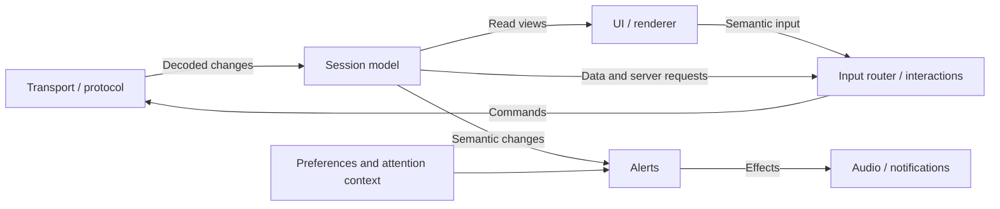

# Кодовая архитектура TomeNET SV

2026-09-21. Статус: согласовано. Решения интервью Q4–Q14 и целостный проект
подтверждены пользователем на финальной сверке. Описывает целевую архитектуру, а не полноту
текущей реализации. Термины: [CONTEXT.md](../CONTEXT.md).

## Цель и форма

Приоритеты — перенос игровых возможностей и дальнейшая переработка UX.
Правила проверяются отдельно от интерфейса; изменение компоновки и способа ввода
не требует переделки сетевой логики. Behavior baseline сохраняется, сервер
остаётся авторитетом игровых результатов.

Основа — модули с небольшими явными интерфейсами и владельцами состояния,
последовательная обработка входов в главном потоке и направленная передача
результатов. События используются по смыслу задачи; общая publish/subscribe шина
не является основой клиента. Механизм связи выбирается для конкретного интерфейса.

## Ответственность модулей

| Модуль | Ответственность |
|---|---|
| Application / lifecycle | Сборка зависимостей, порядок работы, создание и закрытие сессии, решение о её завершении |
| Transport / protocol | Соединение, частичные данные, версии протокола, перевод пакетов и смысловых команд |
| Session presentation model | Известные клиенту игровые данные, коллекции, запросы сервера, согласованное применение изменений и версии областей состояния |
| Input router / взаимодействия | Контексты и bindings, макросы, смысловой ввод, незавершённые выборы, подтверждения и отмена |
| Предупреждения | Реакции на игровые изменения с учётом настроек и контекста внимания игрока |
| UI / renderer | Отображение, локальное состояние представления, компоновка, производные кэши и графические ресурсы |
| Audio / внешние исполнители | Исполнение адресных результатов без знания правил их возникновения |

Это логические модули, а не требование создать по одному файлу для каждой строки.
Внутри модели статусы, инвентарь и сообщения могут иметь собственные подмодули;
взаимодействия могут разделяться по сценариям. Input router сохраняет владение
смысловым контекстом и незавершённым вводом через эти внутренние модули.

Application связывает устойчивые интерфейсы, без ветки на каждую игровую ситуацию.
Добавление предупреждения меняет соответствующее правило и при необходимости
исполнителя; появление новой ответственности уровня приложения может менять сборку.
Группировка результатов по получателям не разрешает менять значимый порядок исполнения.

## Размещение исходников

Текущее дерево `src/client/sv` сгруппировано по ответственности
([SV-ARCH-003](tasks/SV-ARCH-003-group-sv-sources-by-module.md)):

| Путь внутри SV | Содержимое |
|---|---|
| `main.c`, `app.[ch]`, `result.[ch]` | Запуск, сборка модулей/lifecycle и общий контракт результата |
| `session/` | Модель сессии и правила предупреждений (`session`, `alerts`) |
| `protocol/` | Декодирование, сериализация, сравнение версий и локальные helpers |
| `input/` | Router, контексты/макросы и отдельный адаптер SDL-ввода |
| `ui/` | Layout/rendering, шрифты, подготовка статуса и текста сообщений |
| `diagnostics/` | Измерение времени до отправки кадра |

Includes используют явный путь от единственного корня SV, например
`session/session.h` и `ui/font.h`. Вложенные objects и `.d` dependencies сохраняют
эту структуру внутри изолированного output каталога соответствующей платформы.
Session использует локальный `protocol/hp-update.h` для baseline HP apply;
это существующая зависимость, сохранённая при переносе.

Размещение файлов не меняет interfaces и владельцев состояния. SDL-адаптер ввода
остаётся отдельным от headless router; `ui/status` готовит представление, а
семантическое состояние HP принадлежит session model. Временный bootstrap/peer
живёт в `src/temporary/sv`, сценарии — в `tests/sv/scenarios`.

## Потоки данных

Стрелки обозначают смысловые связи, собираемые приложением, а не обязательные
прямые вызовы между всеми изображёнными модулями.

Команда выражает намерение, которое может быть отклонено. Изменение описывает
полностью декодированные входные данные. Представление показывает текущее состояние.
Разовый результат требует реакции и не заменяется чтением последнего состояния.

## Главный цикл и доставка

1. Принять доступные входы без длительного блокирования главного потока.
2. Полностью обработать один вход: обновить модель, вычислить реакции, передать
   результаты исполнителям. Не ждать окончания звука или внешнего I/O.
3. Продолжать в пределах бюджета времени или числа входов; уступать UI между
   целыми входами. Сохранять порядок сетевых обновлений.
4. В фазе построения кадра читать согласованное состояние без его изменения,
   обновлять необходимые кэши и выполнять отрисовку.

Результаты фоновой работы поступают отдельными входами. Исполнитель не запускает
рекурсивное изменение модели. Очереди вводятся для необходимого откладывания;
они ограничены и имеют явные правила владения данными и обработки перегрузки.
Бюджет цикла не компенсирует один длинный обработчик: его работа должна оставаться
короткой либо разбиваться/выноситься в фон с сохранением смысловой целостности входа.

## Чтение состояния и стоимость UI

Малые значения возвращаются копией. Большие представления доступны только для чтения
на время построения кадра; заимствованные указатели не переживают эту фазу.
Между кадрами UI хранит собственное состояние отображения, устойчивые идентификаторы
и восстановимые производные данные, а модель остаётся источником истины.

Версии областей состояния позволяют не повторять чтение и подготовку неизменившихся
данных. Кэши учитывают также шрифты, масштаб, геометрию и другие входы представления.
Начинаем с крупных областей; детализацию изменений добавляем по измерениям.
Анимации и отрисовка имеют собственную частоту. Версии не заменяют доставку разовых реакций.

## Жизненный цикл и отказы

Действия и фоновые задачи сессии привязаны к её поколению. При закрытии прекращается
приём её команд и отменяются связанные взаимодействия. Запоздавшие результаты
не применяются к новой сессии; принадлежащие им ресурсы освобождаются.
Шрифты, аудиопаки и настройки приложения живут независимо от сессии.

Неисправность дополнительной возможности сообщается без автоматического разрыва
соединения. Устаревший выбор обрабатывается по правилам действия, частичный пакет
ожидает продолжения, восстановимые ошибки протокола следуют behavior baseline.
Невозможность сохранить корректность или обязательные данные завершает сессию
с понятной причиной, оставляя приложение работающим.

При перегрузке ограничивается приём новых данных, где транспорт это допускает,
и обрабатывается накопленное. Неограниченного роста памяти и молчаливого удаления
игровых изменений нет; если безопасное продолжение невозможно, сессия завершается.
Модули сообщают смысловые ошибки, решение о завершении принадлежит lifecycle.

## Проверка на сценариях

- **HP `50 → 10 → 50` при максимуме 100.** UI может показать итоговые 50;
  модуль предупреждений получает каждое изменение. При включённой настройке
  предупреждение для 10 не исчезает; сохраняются baseline-условия, включая
  повторные подходящие пакеты, а не только пересечение порога.
- **Чат.** Модель хранит упорядоченные сообщения и обрабатывает служебные изменения
  по протоколу. Представления истории и ленты могут обновляться реже поступления
  сообщений; одинаковый текст сам по себе не является основанием объединять поступления.
- **Выбор предмета и направления.** Взаимодействие хранит незавершённый шаг,
  UI представляет выбор, сеть продолжает обрабатываться. Актуальность выбора
  проверяется по правилам действия; отмена и макросы сохраняют baseline-семантику.
- **Переподключение.** Выбор и запоздавшая задача старого поколения не могут
  отправить команду или изменить состояние нового соединения.

## Перенос и проверка реализации

С 2026-09-22 применяется [правило изоляции SV](../AGENTS.md): оно уточняет
прежние требования к переиспользованию реализации. Отдельные предложения
рефакторинга и исправления существующего кода ведутся в
[списке улучшений](sv-improvements.md).

Корректировка уже начатого shell/HP-среза описана в задаче
[SV-ARCH-001](tasks/SV-ARCH-001-align-current-implementation.md).

Переносим по одной возможности: сохраняем проверенную семантику и самостоятельные
legacy-функции, перерабатываем связанные с терминалом сценарии. Начатый SV-код
также допускает переработку под принятые интерфейсы.
Для каждого переноса проверяются игровое поведение, отмена и макросы; правила
должны проверяться отдельно от настоящего окна и сервера. Это не заменяет проверки
реального рендеринга, протокольной совместимости и платформенного поведения.

## Детали следующих этапов

Архитектурные принципы выше согласованы. При реализации конкретных возможностей
ещё требуется определить, не подменяя эти вопросы скрытыми допущениями:

- C-типы, сигнатуры и внутреннее разбиение файлов, владение отложенными payloads.
- Порядок обслуживания независимых источников, конкретные бюджеты и размеры буферов.
- Протокол отмены фоновых задач и освобождения ресурсов.
- Соответствие контекста внимания нового UI legacy off-panel условиям предупреждений.
- Подробные переходы каждого взаимодействия и version-aware правила протокола.

Это сводка проектирования: производительность целевого цикла и полная совместимость
ещё не подтверждены реализацией. Текущее состояние описано в [sv-hp.md](sv-hp.md).

## Основания решений

- [ADR-0001: модель, взаимодействия и UI](adr/0001-separate-session-interactions-and-ui.md)
- [ADR-0002: главный поток и бюджет работы](adr/0002-main-thread-state-ownership.md)
- [ADR-0003: связи модулей и порядок обработки](adr/0003-explicit-module-connections.md)
- [ADR-0004: версии и кэши UI](adr/0004-revision-based-ui-views.md)
- [ADR-0005: поколение сессии](adr/0005-session-scoped-work.md)
- [ADR-0006: ошибки и перегрузка](adr/0006-errors-and-overload.md)
- [Исследование альтернатив](research/sv-client-architecture.md)
